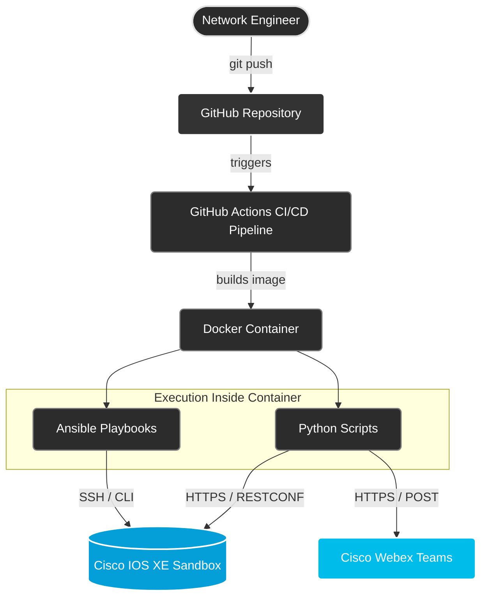

# Cisco NetDevOps: Comprehensive Network Automation Framework 🚀


## Overview
This repository contains a comprehensive **NetDevOps** project demonstrating Infrastructure as Code (IaC), API-driven automation, and **ChatOps** principles. It features a hybrid automation framework utilizing both Ansible and Python to manage and audit Cisco IOS XE devices.

The project goes beyond basic CLI configuration management by implementing real-world modern scenarios: extracting operational network data, provisioning devices via **RESTCONF API**, sending real-time alerts using the Cisco Webex API, and performing state validation. The core audit functionality is seamlessly integrated into a **GitHub Actions CI/CD pipeline**, ensuring that every code push triggers an isolated, automated network validation inside a Docker container against a live Cisco Sandbox environment.



## Key Features
* **API-Driven Networking (RESTCONF):** Utilizing the Python `requests` library to interact with the Cisco IOS XE REST API.
* **Infrastructure as Code (IaC):** Network state verification, configuration backups, and base standardizations defined in Ansible YAML playbooks.
* **ChatOps Integration:** Automated network alerts and operational data reports are sent directly to Cisco Webex spaces using Webex APIs.
* **Dynamic Templating:** Generating device configurations programmatically using Jinja2 and YAML variable files.
* **Containerized Execution:** Ephemeral, lightweight Docker container ensuring consistent execution across any environment without local dependency conflicts.
* **Automated CI/CD Pipeline:** GitHub Actions automatically builds the Docker image and runs the network test suite upon every repository push.

## Technology Stack
* **Automation Engines:** Ansible (`cisco.ios` collection), Python 3.12
* **API & Libraries:** `requests` (HTTP client), Cisco Webex API, RESTCONF
* **Templating & Data:** Jinja2, YAML, JSON
* **Containerization & CI/CD:** Docker, GitHub Actions
* **Target Environment:** Cisco DevNet Always-On Sandbox (IOS XE on Catalyst 8000)

## Repository Structure & Modules

The repository is modularized into distinct directories based on automation tools and goals.

### 🐍 Python & REST API Scripts (`/scripts`)
* `config_router.py` - Interacts with the **RESTCONF API** via the `requests` library to provision interfaces. It features pre-flight IP address validation, renders dynamic JSON payloads using `vars.yml` and `template.j2`, verifies the applied configuration on the device, and sends a success notification to Webex.
* `get_interfaces.py` - Connects to the Cisco device via **RESTCONF API** to retrieve interface states, parses the operational data (counting UP/DOWN statuses), and automatically dispatches a summarized ChatOps report to Cisco Webex.
* `webex_alert.py` - Integrates with the Cisco Webex API to send automated messages, alerts, and parsed network data to a dedicated Webex room.

### 📜 Ansible Playbooks (`/playbooks`)
* `test_connection.yml` - Validates initial connectivity and authentication with the target network inventory.
* `backup_config.yml` - Connects to the routers and securely backs up the running configuration to the local environment.
* `base_config.yml` - Pushes a standardized base configuration to the network devices to ensure compliance.
* `network_test.yml` - The primary audit script used in the CI/CD pipeline. It strictly verifies if the required NTP servers are configured and checks the operational state of critical interfaces.

### ⚙️ Infrastructure & Configuration
* `.github/workflows/` - Contains the CI/CD pipeline definition.
* `inventory/` - Ansible dynamic/static inventory configurations.
* `Dockerfile` - Instructions to build the isolated NetDevOps execution environment.
* `requirements.txt` / `requirements.yml` - Python and Ansible dependencies.
* `template.env` - Secure template for local environment variables.

## How to Run Locally

To execute this automation framework on your local machine, ensure you have Docker installed.

**1. Clone the repository**
```bash
git clone https://github.com/Alan1234111/Network-Automation.git
cd Network-Automation
```

**2. Configure Environment Variables**

Copy the template environment file and provide your Cisco Sandbox and Webex credentials.

```bash
cp template.env .env
```

Edit the .env file with your specific ROUTER_IP, ROUTER_USER, ROUTER_PASS, WEBEX_TOKEN, and WEBEX_ROOM_ID.

**3. Build the Docker Image**

```bash
docker build -t netdevops-ansible .
```

**4. Run the Automation Locally**

Execute any Ansible playbook or Python script inside the ephemeral Docker container using your `.env` credentials.

**Example 1: Run the network audit via Ansible**
```bash
docker run --rm \
  --env-file .env \
  -e ANSIBLE_HOST_KEY_CHECKING=False \
  netdevops-ansible ansible-playbook playbooks/network_test.yml
```

**Example 2: Retrieve interface data via Python REST API script**
```bash
docker run --rm \
  --env-file .env \
  netdevops-ansible python scripts/get_interfaces.py
```
(By modifying the command at the end, you can run any tool or script available inside the container's environment).

## 📸 Demo & ChatOps Preview
Below is an example of real-time operational reports delivered directly to a Cisco Webex space via the API script (webex_alert.py / get_interfaces.py):


## CI/CD Pipeline

The GitHub Actions workflow is triggered on every push. It provisions an Ubuntu runner, builds the Docker image, securely injects credentials from GitHub Secrets, and executes the network_test.yml playbook.

### 🔐 Prerequisites for GitHub Actions
If you fork this repository, you must configure the following **Repository Secrets** in GitHub (*Settings -> Secrets and variables -> Actions*) for the pipeline to succeed:
* `ROUTER_IP`
* `ROUTER_USER`
* `ROUTER_PASS`
